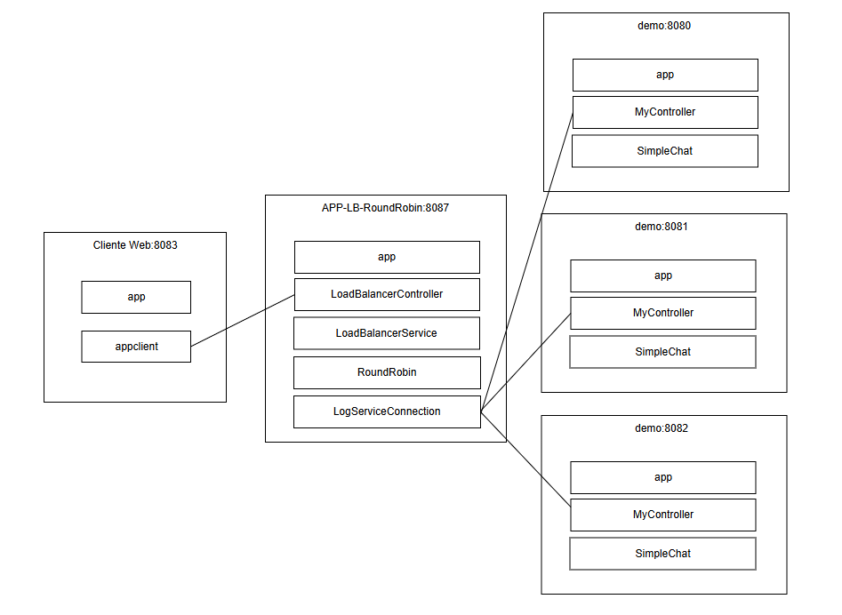
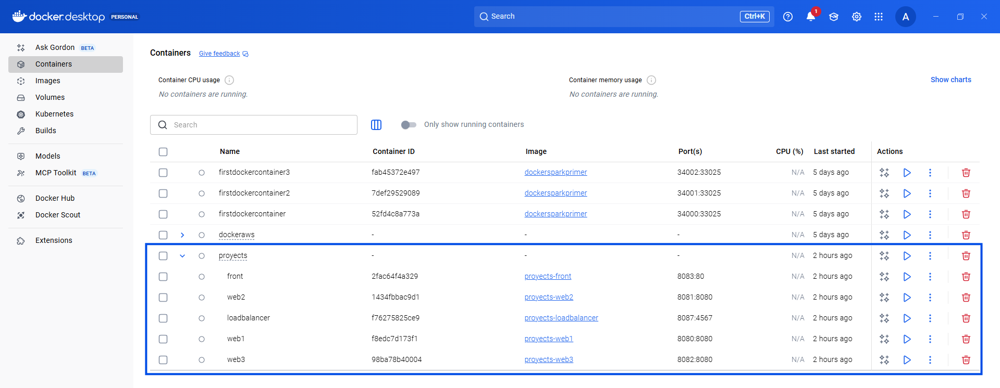
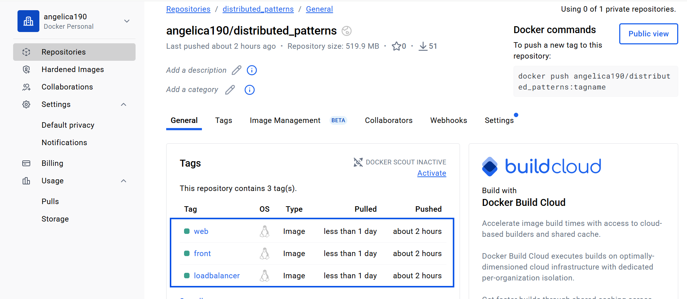
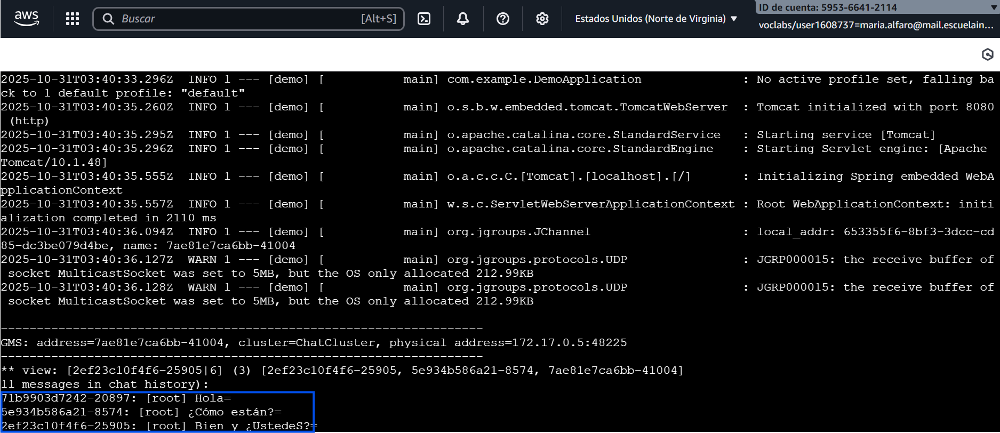

# Distributed patterns 💻

### María Angélica Alfaro Fandiño

## 🔨 Arquitectura

Construcción de un balanceador de carga **APP-LB-RoundRobin**, junto con un archivo **index.html** y una aplicación de **chat grupal desarrollada en Spring Boot**. Las imágenes Docker correspondientes se generan para la aplicación, se publican en un repositorio en **DockerHub** y finalmente se despliegan en una **máquina virtual en AWS**.

### ***Descripción***

La arquitectura presentada corresponde a una aplicación web APP-LB-RoundRobin, compuesta por un cliente y un servidor. El cliente, representado por el navegador, se comunica mediante el protocolo HTTP con un backend desplegado en una instancia EC2 de AWS, donde se ejecuta un microcontenedor Docker que aloja una aplicación desarrollada en Java con Spring Boot. Esta aplicación expone servicios REST que atienden las solicitudes del navegador y ejecutan un algoritmo de balanceo de carga Round Robin. El cliente web, a través de un botón, envía los mensajes del usuario al servicio REST, el cual los distribuye entre tres instancias del servicio demo el cual inicializa un chat en tiempo real. Esta arquitectura, que separa la interfaz de usuario de la lógica de negocio, facilita la escalabilidad y garantiza la tolerancia a fallos.

## 🔎 Proceso de configuración

1. Creación de las aplicaciones APP-LB-RoundRobin, index.html y Demo, las cuales integran la configuración del balanceador de carga, el servidor web y el chat grupal en tiempo real.

2. Creación de los archivos DockerFile y dockercompose para la construcción de imagenes de las aplicaciones.

    

4. Creación de un repositorio en Docker Hub y carga de las imagenes al repositorio. 

    

6. Inicialización de una instancia EC2 en AWS, instalación de Docker en la máquina y despliegue de las imagenes alojadas en Docker Hub.

    
