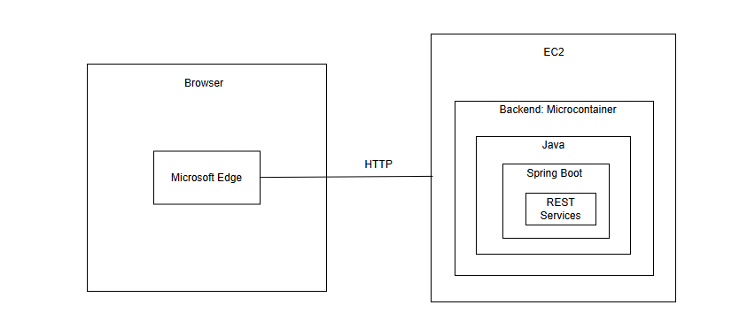
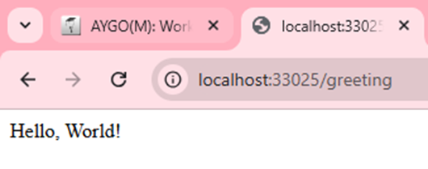
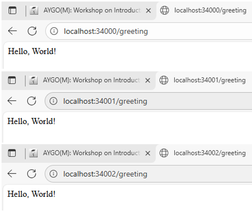
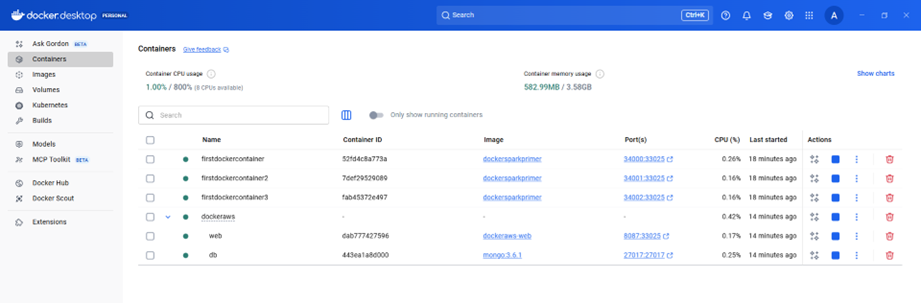
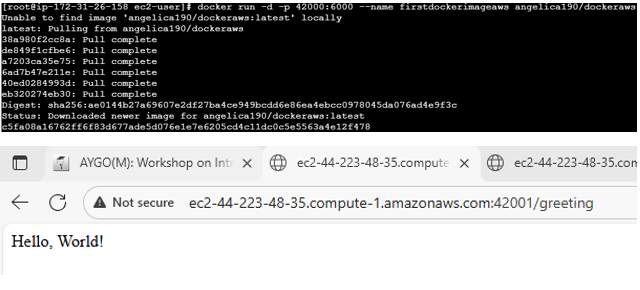

# Introduction to Virtualization and Distributed Programming 💻

### María Angélica Alfaro Fandiño

## 🔨 Arquitectura

La imagen muestra una **arquitectura simple de una aplicación web basada en microservicios**, desplegada en **AWS (Amazon EC2)** y desarrollada con **Spring Boot**.

### ***Descripción***

La arquitectura muestra una aplicación web compuesta por un cliente y un servidor. El cliente, representado por el navegador Microsoft Edge, se comunica mediante el protocolo HTTP con un backend desplegado en una instancia EC2 de AWS. En esta instancia se ejecuta un microcontenedor que aloja una aplicación desarrollada en Java con Spring Boot, la cual expone servicios REST para atender las solicitudes del navegador. Esta estructura permite separar la interfaz de usuario de la lógica de negocio, facilitando la escalabilidad y el mantenimiento del sistema.

## 🔎 Proceso de configuración

1. Creación de una aplicación Spring Boot utilizando Maven, incluyendo las dependencias necesarias para su correcta ejecución..

2. Invocación de la Máquina Virtual de Java (JVM) desde la línea de comandos para ejecutar la aplicación de forma local.

    

3. Configuración del archivo Dockerfile para la construcción de la imagen y la creación de tres instancias del contenedor en Docker.

    

4. Despliegue y ejecución del archivo docker-compose, mostrando a continuación el resumen del proceso en Docker Desktop.

    

5. Creación de un repositorio en Docker Hub y carga de la imagen creada al repositorio. 

    

6. Inicialización de una instancia EC2 en AWS, instalación de Docker en la máquina y despliegue de la imagen alojada en Docker Hub.

    
