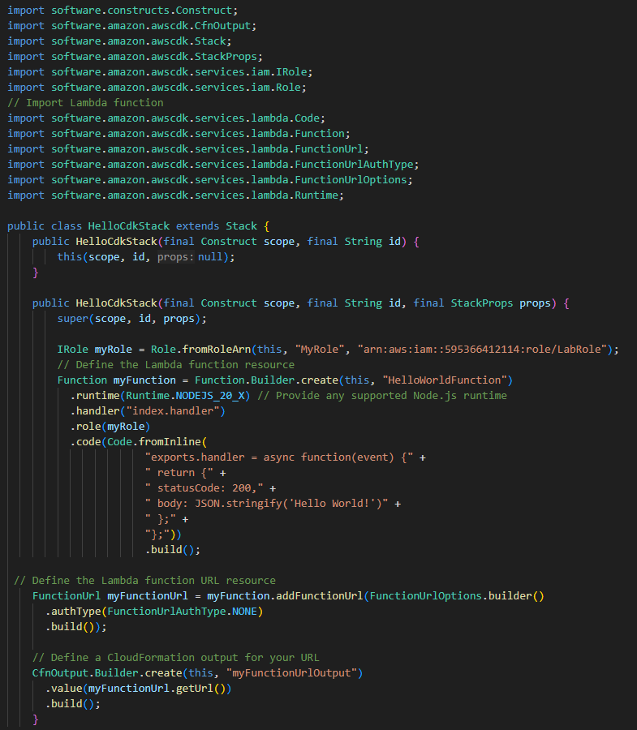
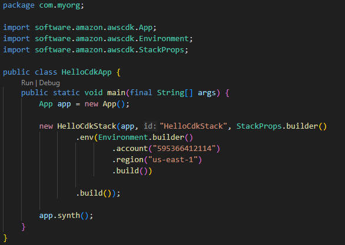
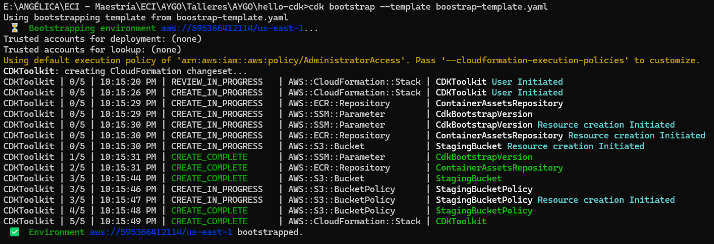
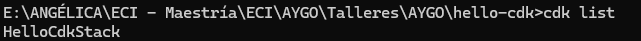
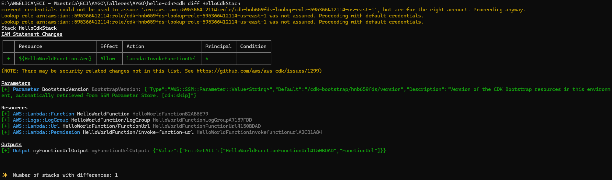
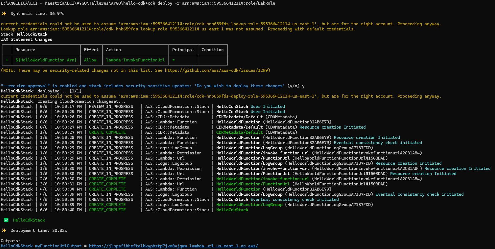
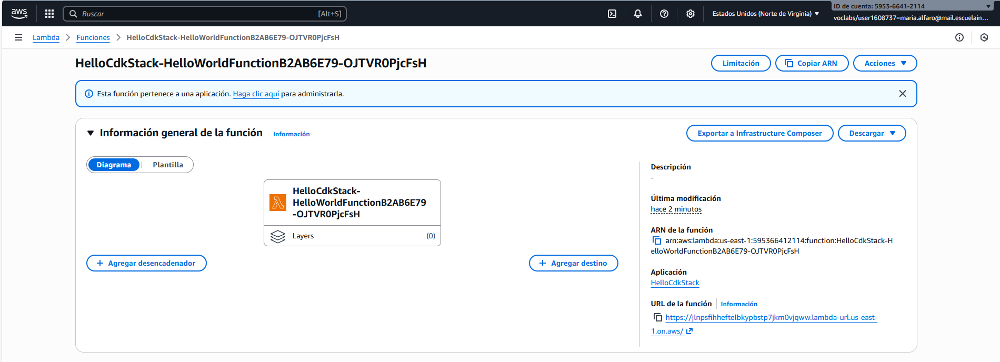
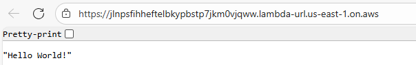

# Web app automatically deployed to AWS 💻

### María Angélica Alfaro Fandiño

### ***Descripción***

Creación e implementación de una aplicación sencilla en AWS mediante AWS CDK. La aplicación consta de una función AWS Lambda que devuelve un ***Hello World!***. La función se invoca a través de una URL de función Lambda que actúa como un punto de conexión HTTP(S) dedicado.

#### Stack

Creación del stack que define la función Lambda, configura la URL pública del recurso y utiliza un rol por defecto para la asignación de permisos requeridos.

#### main
Desarrollo del archivo principal responsable de la inicialización del stack, con la asignación del nombre "HelloCdkStack" para su identificación en el proyecto.

## 🔎 Proceso de configuración

### Creación de recursos

1. ***cdk boostrap:*** Crea los recursos necesarios para permitir el despliegue de stacks mediante cdk deploy, incluyendo un bucket de S3, parámetros en Parameter Store y los roles requeridos.
Sin embargo, en este caso no se contaba con los permisos necesarios para la creación de roles, por lo que fue necesario modificar la plantilla (template) documentando la creación de cada uno de ellos.

    

2. ***cdk ls:*** Lista los stacks definidos dentro de la aplicación, mostrando los nombres de aquellos que pueden ser desplegados.

    

3. ***cdk diff {stackName}:*** Muestra las diferencias entre el estado actual del stack y la última versión desplegada. En este caso, al tratarse del primer despliegue, el comando únicamente muestra la creación de la función Lambda.

    

### Despliegue de infraestructura con CDK

1. ***cdk deploy {stackName}*** Ejecuta el despliegue de los recursos definidos en el stack, generando en este caso la función Lambda.
Sin embargo, al no contar con los roles predeterminados requeridos por CDK, fue necesario indicar explícitamente el rol bajo el cual se realizaría la operación.

    
    
    