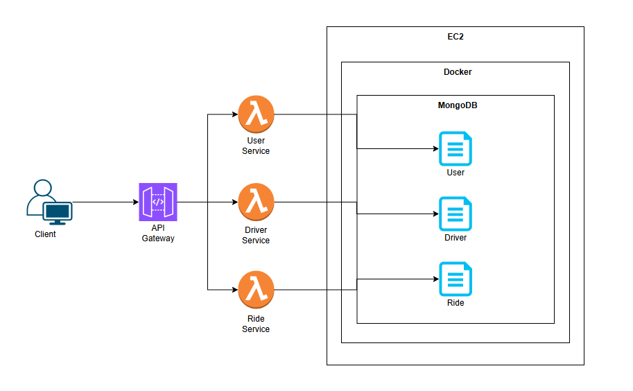
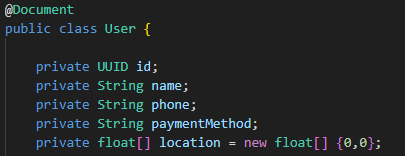
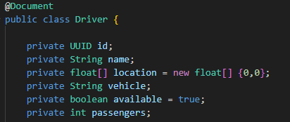
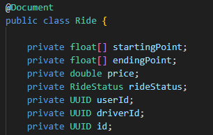
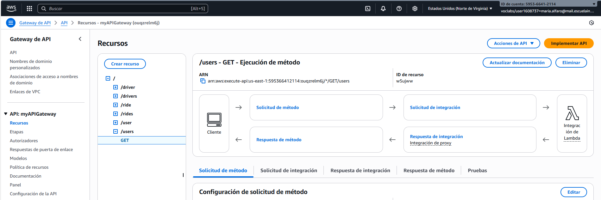
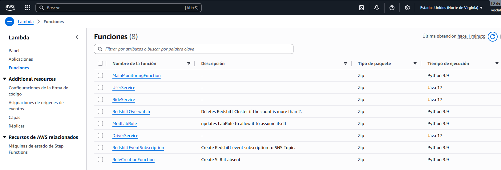
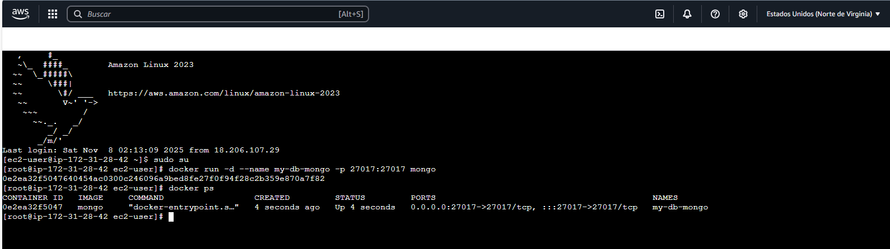
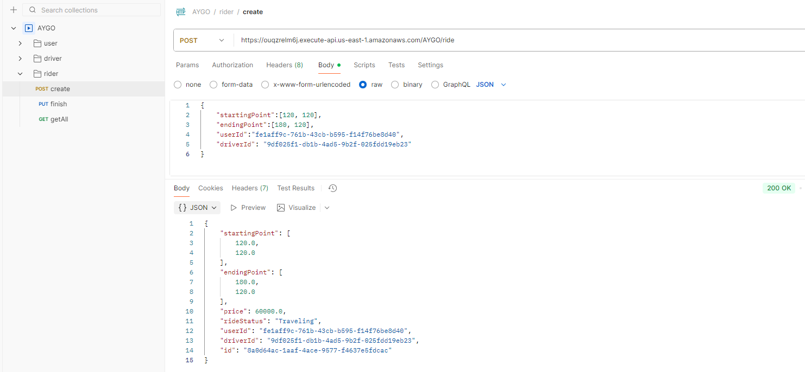

# Distributed patterns 💻

### María Angélica Alfaro Fandiño

## 🔨 Arquitectura

Diseño de una arquitectura de microservicios para una plataforma de transporte compartido (Uber) y construcción de un prototipo para la aplicación usando las herramientas que ofrece AWS como **API Gateway**, **Lambda** y **EC2**

### ***Descripción***

### Base de datos (EC2 - MongoDb)

Uso de una instancia EC2 que ejecuta un contenedor Docker con la base de datos MongoDB. Además, el contenedor emplea un volumen de Docker para garantizar la persistencia de los datos.

### Servicios (Lambda)

El prototipo emplea tres servicios (User, Driver y Ride), cada uno alojado en una Lambda.

#### * *User*
El servicio User es el encargado de realizar las solicitudes de viaje. Su función principal es solicitar los conductores disponibles y obtener el valor estimado del viaje según las características del vehículo ofrecido. Además, debe incluir atributos como el número de teléfono, para facilitar la comunicación con el conductor, y la ubicación actual del usuario, que se utiliza para calcular el costo del viaje desde el punto de origen hasta el destino.

##### Endpoints

* **Crear usuario:** (POST /user)
* **Obtener usuarios:** (GET /users)
* **Obtener opciones de viaje:** (GET /user/{userId}/destination)
* **Pedir viaje:** (POST /user/{userId}/askTravel) 

#### * *Driver*
El servicio Driver se encarga de aceptar las solicitudes de viaje de los usuarios y prestar el servicio correspondiente. Entre sus atributos se incluyen la disponibilidad del conductor, las características del vehículo y su ubicación actual, información necesaria para calcular el costo estimado del viaje.

##### Endpoints

* **Crear conductor:** (POST /driver)
* **Obtener conductores:** (GET /drivers)
* **Obtener conductor:** (GET /driver/{driverId})
* **Obtener conductores cercanos**: (GET /drivers/point/{startingx}/{startingy})
* **Actualizar disponibilidad:** (PUT /driver/{driverId}/udpate/status)
* **Actualizar localización:** (PUT /driver/{driverId}/udpate/location)

#### * *Ride*
El servicio Ride representa el viaje y contiene la información relacionada con este. Incluye los identificadores del usuario y del conductor para identificar a los participantes, así como la localización inicial, final y actual del trayecto. Además, almacena el precio del viaje y su estado, que puede ser uno de los siguientes: WaitingResponseDriver, UserWaitingDriverTraveling, Traveling o Finish.

##### Endpoints

* **Crear viaje:** (POST /ride)
  **Obtener viajes** (GET /rides)
* **Obtener viaje:** (GET /ride/{rideId})
* **Obtener opciones de viaje:** (GET /rides/options?startingx&startingy&endingx&endingy")
* **Finalizar viaje:** (PUT /ride/{rideId}/finish)

## 🔎 Proceso de configuración

1. Creación de los servicios User, Driver y Ride, junto con la definición de sus recursos y la asignación de los métodos HTTP correspondientes.

2. Configuración del API Gateway, Lambdas y EC2 en AWS.

    
    
    

3. Relización de pruebas desde Postman. 

    
