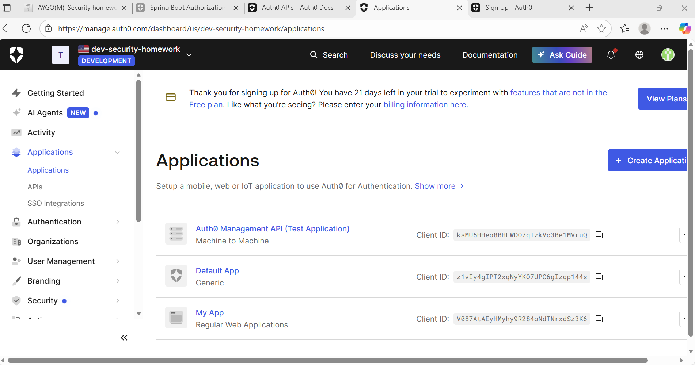
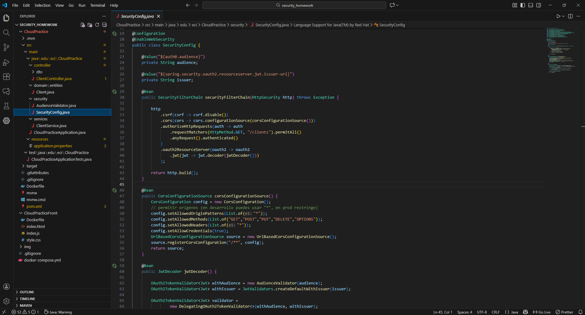
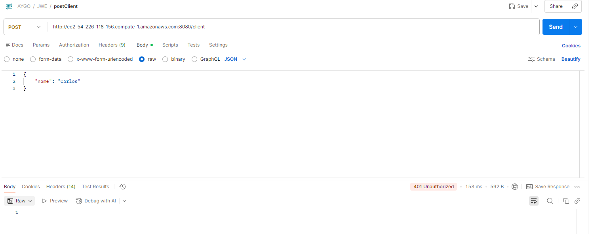
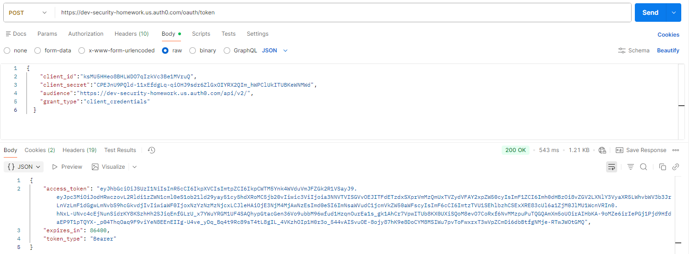
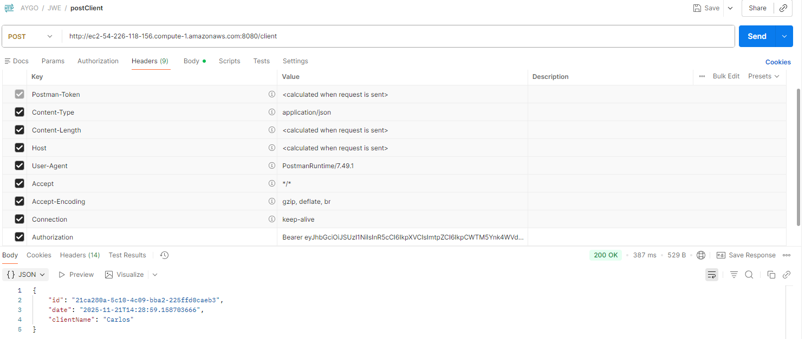
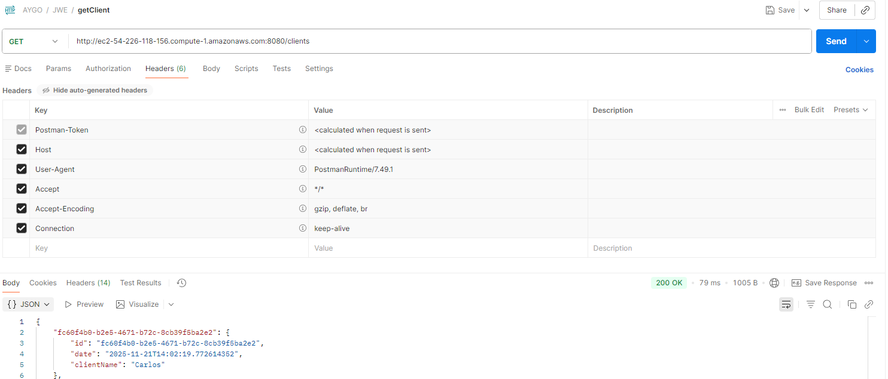
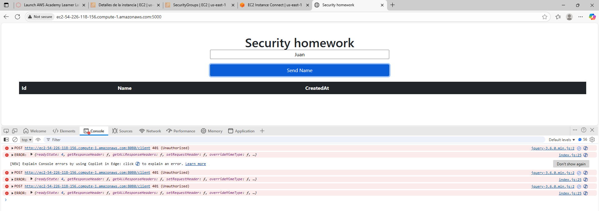
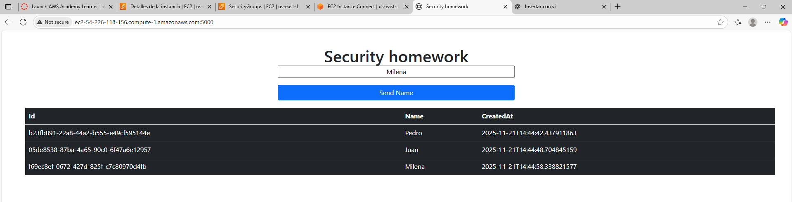

# Security homework - JWT 💻

### María Angélica Alfaro Fandiño

## 🔨 Arquitectura

### **Descripción**

Creación e implementación de una aplicación sencilla en AWS usando Docker y autorización basada en JWT para proteger los endpoints del servidor.

### ***Frontend + Backend + JWT: Principios de Zero Trust***

El modelo Zero Trust se fundamenta en la premisa de “nunca confiar, siempre verificar”, incluso cuando las solicitudes provienen de la misma red o aplicación. En este proyecto, la arquitectura implementada (compuesta por un frontend y un backend protegidos mediante JWT) incorpora de manera directa varios de los principios esenciales de Zero Trust:

**1. Verificación continua de identidad**

* Cada solicitud que el frontend hace al backend incluye el token.

* El backend valida el JWT en cada petición, sin asumir que la sesión autenticada previamente sigue siendo válida.

***NOTA:*** Se verifica la identidad del usuario en cada solicitud.

**2. Menor privilegio (Least Privilege)**

* El backend permite únicamente las operaciones definidas según los permisos contenidos en el token.

***NOTA:*** Cada usuario obtiene solo el nivel mínimo de acceso requerido.

**3. Autenticación y autorización**

* El backend verifica firma, integridad, fecha de expiración, issuer, audience, etc.
* El acceso se concede únicamente si el token es válido.

***NOTA:*** La API no procesa ninguna operación si no existe autenticación + autorización.

**4. Credenciales con tiempo de expiración**

* Los tokens tienen un tiempo expiración definida.
* Es posible refrescar los tokens para evitar riesgos de tokens robados.

***NOTA:*** Las credenciales tienen vida limitada y requieren renovación periódica.

**5. Integridad y verificación de datos**

* Cualquier modificación del token invalida el acceso.
* Se evitan ataques de manipulación de sesiones.

***NOTA:*** El sistema verifica que los datos no han sido alterados durante la solicitud.

## 🔎 Proceso de configuración

### Creación de recursos

1. **Cuenta en Auth0:** Creación de una cuenta en Auth0 y un API para tener un servicio completo de autenticación y autorización. Auth0 funciona como un Identity Provider (IdP) que permite gestionar usuarios, controlar inicios de sesión, administrar roles, emitir y validar tokens JWT.

    

2. **securityConfig:** Configuracion de toda la seguridad del backend usando Spring Security, JWT y Auth0. Define qué endpoints requieren autenticación, cómo validar el JWT, y cómo manejar CORS.

    

### Validación y pruebas

#### ***Postman***

1. Solicitud sin token - 401 Unauthorized.
    

2. Obtención del token.
    

3. Envío de solicitudes autenticadas mediante el token obtenido.
    
    

#### ***frontend***

1. Solicitud sin token - 401 Unauthorized.
    

3. Envío de solicitudes autenticadas mediante el token obtenido.
    
