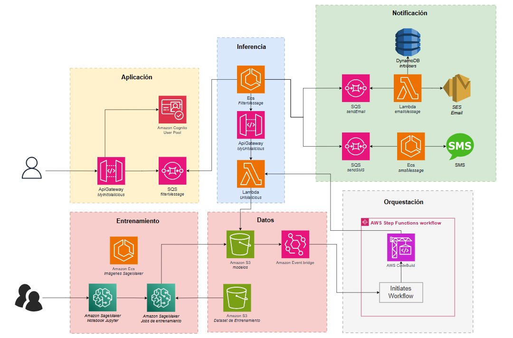
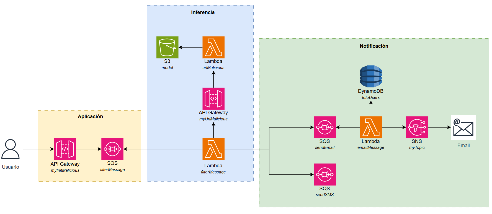

# Detección de URLs maliciosas para prevención de fraude 💻

### María Angélica Alfaro Fandiño

### ***Descripción***
Se presenta el diseño de un sistema automatizado para la clasificación de URLs con el fin de fortalecer los procesos de comunicación y prevenir la propagación de enlaces maliciosos. La propuesta se basa en una arquitectura orientada a eventos que analiza cada URL enviada por un usuario y determina si su contenido es legítimo o potencialmente dañino. Cuando se detecta una URL maliciosa, el sistema envía automáticamente un correo electrónico al remitente informando que el mensaje no pudo ser entregado por motivos de seguridad. Por el contrario, si la URL es clasificada como legítima, se envía un mensaje SMS al destinatario notificando la recepción correcta del enlace. Este enfoque permite optimizar la gestión de mensajes, reducir riesgos asociados al fraude digital y mejorar la experiencia del usuario mediante respuestas oportunas y automatizadas.

## 🔨 Arquitectura propuesta

## 🔨 Prototipo

## 🔎 Metodología
La metodología empleada para el desarrollo del sistema de clasificación de URLs se estructuró en cuatro fases principales: recolección y preparación de datos, entrenamiento del modelo, diseño de la arquitectura del sistema e integración del flujo de notificaciones. Cada fase se describe a continuación.
    
***1. Recolección y preparación de datos:*** Se construyó un conjunto de datos compuesto por 277 URLs, las cuales fueron etiquetadas manualmente como maliciosas o benignas según su estructura y comportamiento reportado. Para facilitar su análisis, cada URL fue descompuesta en sus componentes principales —como dominio, subdominio, longitud, parámetros y presencia de caracteres sospechosos— generando una tabla de características que sirvió como insumo para el modelo de clasificación.

***2. Entrenamiento del modelo de clasificación:*** El modelo se implementó utilizando regresión logística, dada su eficacia en tareas de clasificación binaria y su capacidad para manejar características simples derivadas de la estructura de las URLs. El entrenamiento se llevó a cabo en Python mediante la biblioteca Scikit-learn, utilizando el conjunto de 277 instancias previamente tokenizadas y estructuradas. Se evaluó el desempeño del modelo mediante validación interna, verificando que la combinación de características seleccionadas permitiera diferenciar adecuadamente entre URLs maliciosas y legítimas.

***3. Diseño de la arquitectura orientada a eventos:*** Con el modelo de clasificación entrenado, se diseñó una arquitectura basada en eventos para automatizar el flujo de análisis de las URLs. El sistema recibe las URLs enviadas por los usuarios a través de un punto de entrada y ejecuta una función de clasificación que determina su categoría en tiempo real. Esta arquitectura facilita la escalabilidad del sistema y permite procesar múltiples solicitudes de manera simultánea sin intervención manual.

***4. Integración del sistema de notificaciones:*** Una vez determinada la categoría de la URL, el sistema activa una acción correspondiente. Si la URL es clasificada como maliciosa, se envía automáticamente un correo electrónico al remitente, notificando que el mensaje fue bloqueado por motivos de seguridad. En cambio, si la URL es identificada como legítima, se envía un mensaje SMS al destinatario, informando la disponibilidad del enlace. Este proceso automatizado garantiza una respuesta eficiente y oportuna para todos los casos evaluados.
